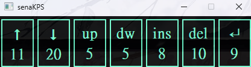
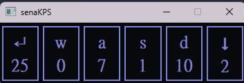

# senaKPS

a key record app for all people.

change settings.json settings to count key press.

07/08:
* fix font size cannot be displayed properly during initialization.
* fix numbers being hidden in the border when they are too long.

07/06:
* now can load senakps file and record key press counter.

07/01:
* fix sleep mode path cannot be obtained bug.

06/29:
* add save settings method.
* add load settings method.

06/28:
* now can use [setting.py](https://github.com/peter910820/senaKPS/blob/main/setting.py) to change settings(settings.json)

06/27:
* now can add keyEvent to record more keys
* now can record number of clicks to .senakps file